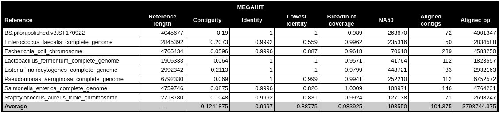
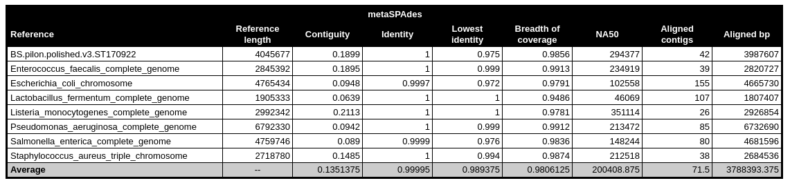
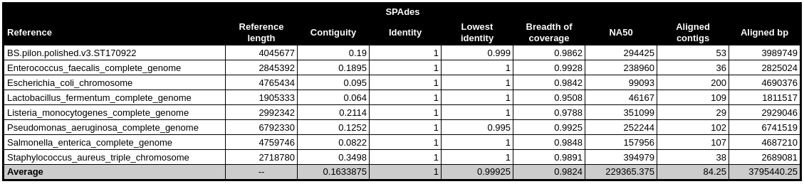
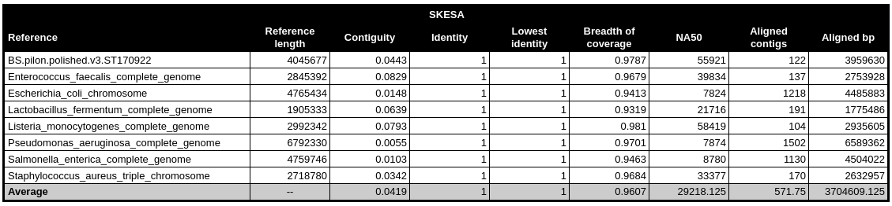
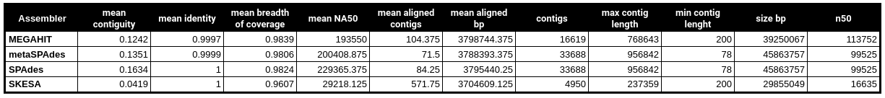
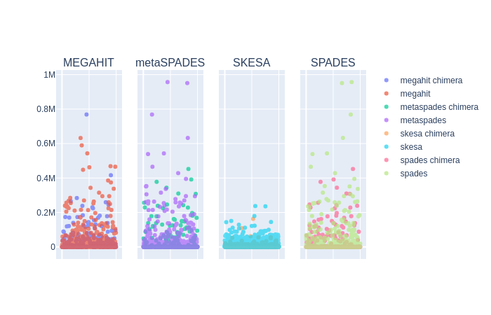
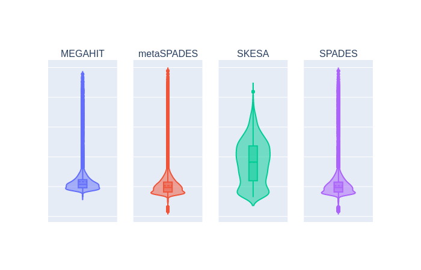

#  Benchmarking of de novo metagenomic assembly software

While searching for a benchmark with relevant metagenomic assembly software, I gave up and decided to make my own. WORK IN PROGRESS 

## Table of Contents

* [Introduction](#introduction)
* [Methods](#methods)
    * [Metagenomic Dataset](#metagenomic-datasets)
        * [simulated dataset](#simulated-dataset)
        * [Zymos community standard](#zymos-community-standard)
        * [Real dataset](#real-dataset)
    * [Assembly softwares and commands](#assembly-softwares-and-commands)
        * [IDBA-UD](#idba-ud)
        * [MegaGTA](#megagta)
        * [MEGAHIT](#megahit)
        * [Snowball](#snowball)
        * [SPAdes](#spades)
        * [MetaSPAdes](#metaspades)
        * [SKESA](#skesa)
        * [Xander](#xander)
    * [Assessing Metagenomic Assembly Success](#assessing-metagenomic-assembly-success)
        * [Assembly Continuity](#assembly-continuity)
* [Results](#resuls)
* [Authors](#authors)

## Introduction

TODO

## Methods

### Metagenomic datasets

#### Simulated dataset
With the [M3S3 tool](http://medweb.bgu.ac.il/m3s3/), a simulation sample was obtained made up of the Zymobiomics 
microbial community standasrd species of bacteria and yeast. The sample has the following composition (obtained with 
Kraken2 with the minimkaken2_V1 database):

  

#### Zymos community Standard
Two commercially available mock communities containing 10 microbial species (ZymoBIOMICS Microbial Community Standards) 
were sequences by [Nicholls et al. 2019](https://academic.oup.com/gigascience/article/8/5/giz043/5486468). Shotgun 
sequencing of the Even and Log communities was performed with the same protocol, with the exception that the Log 
community was sequenced individually on 2 flowcell lanes and the Even community was instead sequenced on an Illumina 
MiSeq using 2×151 bp (paired-end) sequencing. They are available under accession numbers 
[ERR2984773](https://www.ebi.ac.uk/ena/data/view/ERR2984773) (even) and 
[ERR2935805](https://www.ebi.ac.uk/ena/data/view/ERR2935805).

#### Real dataset
As a real metagenomic dataset, the three CAMI synthetic metagenome challenge sets was used (Low (L), Medium with 
differential abundance (M), and High complexity with time series (H)). These datasets are publicly available in 
[GigaDB](http://gigadb.org/dataset/100344). 

### Assembly softwares and commands

[Ayling et al. 2019](https://academic.oup.com/bib/advance-article/doi/10.1093/bib/bbz020/5363831) published recently a 
review on the different approaches for metagenome assembly with short reads, compiling an exhaustive table describing 
the most of [metagenomic assembly tools available](https://academic.oup.com/view-large/131667617). 
A total 17 tools are presented. Of these, [IVA](https://www.ncbi.nlm.nih.gov/pmc/articles/PMC4495290/) and 
[SAVAGE](https://www.ncbi.nlm.nih.gov/pmc/articles/PMC5411778/) were aimed at viruses. Additionally, [Genovo's](https://www.liebertpub.com/doi/abs/10.1089/cmb.2010.0244?rfr_dat=cr_pub%3Dpubmed&url_ver=Z39.88-2003&rfr_id=ori%3Arid%3Acrossref.org&journalCode=cmb) 
and [MAP's](https://academic.oup.com/bioinformatics/article-lookup/doi/10.1093/bioinformatics/bts162) source codes are 
no longer available, [VICUNA](https://www.broadinstitute.org/viral-genomics/viral-genomics-analysis-software-registration) 
requires registration and cannot be executed locally, and [Omega](https://academic.oup.com/bioinformatics/article-lookup/doi/10.1093/bioinformatics/btu395) 
is an assembly pipeline. [MegaGTA](https://www.ncbi.nlm.nih.gov/pmc/articles/PMC5657035/), [Snowball]() and [Xander]() are not *de novo* assemblers, performing instead guided 
assembly targeting specific genes, that falls outside the scope of this review. Of the remaining tools, [BBAP](https://www.ncbi.nlm.nih.gov/pmc/articles/PMC5406902/), 
[MetaVelvet](http://metavelvet.dna.bio.keio.ac.jp/), [PRICE](http://derisilab.ucsf.edu/software/price/) and 
[Ray Meta](https://genomebiology.biomedcentral.com/articles/10.1186/gb-2012-13-12-r122) are also excluded due to no 
update since 2015. 

The following tools will be tested:

#### IDBA-UD :skull:
Published by [Peng et al. 2012](https://academic.oup.com/bioinformatics/article-lookup/doi/10.1093/bioinformatics/bts174), 
it's a De Brujin graph assembler for assembling reads from single-cell sequencing or metagenomic sequencing technologies 
with uneven sequencing depths. It employs multiple depth relative thresholds to remove erroneous k-mers in both 
low-depth and high-depth regions. The technique of local assembly with paired-end information is used to solve the 
branch problem of low-depth short repeat regions. To speed up the process, an error correction step is conducted to 
correct reads of high-depth regions that can be aligned to high confidence contigs. 
The latest version is available at https://github.com/loneknightpy/idba, and an official docker image at
https://hub.docker.com/r/loneknightpy/idba
Last update: 31/12/2016 (GitHub)

docker container: `oneknightpy/idba:latest`
command: ``

#### MetaVelvet-SL :skull:
This De Brujin graph assembler, published by , works similarly to [MetaVelvet](http://metavelvet.dna.bio.keio.ac.jp/) 
by assemblying the data by populating a structure estimated from the coverage of nodes (poisson distributions). The De 
Brujin graph is partitioned into hypothetical subgraphs (possible different species) using these distributions as a 
guide. Differently from MetaVelvet, MetaVelvet-SL identifies chimeric contigs though a support-vector machine (SVM) 
trained on paired-end, converage, and contig lenghts for each dinucleotide and passed on to the De Brujin graph for 
decomposition. 

docker container: `cimendes/metavelvet-sl:1.2.02-1`

#### MEGAHIT
MEGAHIT, published by [Li et al. 2015](https://academic.oup.com/bioinformatics/article/31/10/1674/177884), *de novo* 
assembler for assembling large and complex metagenomics data in a time- and cost-efficient manner. It makes use of 
succinct de Bruijn graph, with a a multiple k-mer size strategy. In each iteration, MEGAHIT cleans potentially erroneous 
edges by removing tips, merging bubbles and removing low local coverage edges,specially useful for metagenomics which 
suffers from non-uniform sequencing depths. 
The latest version is available at https://github.com/voutcn/megahit
Last update: 12/08/2019 (GitHub)

docker container: `cimendes/megahit-assembler:12.08.19-1`
command: `megahit -1 read_1.fq.gz -2 read_2.fq.gz -o out -t 16`

#### SPAdes
A tool aiming to resolve uneven coverage in single cell genome data through multiple k-mer sizes of De Brujin graphs. It
starts with the smallest k-mer size and and adds hypotetical k-mers to connect graph. 
Last update: 11/10/2018 (release) and 24/04/2019 (GitHub)

docker container: `cimendes/metaspades:11.10.2018-1`
command: `spades.py -o out -1 read_1.fq.gz -2 read_2.fq.gz --careful --only-assembler -t 16 -m 32`

#### MetaSPAdes
SPAdes started out as a tool aiming to resolve uneven coverage in single cell genome data, but later metaSPAdes was 
released, building specific metagenomic pipeline on top of SPAdes. It was published by [Nurk et al. 2017](https://www.ncbi.nlm.nih.gov/pmc/articles/PMC5411777/), 
and like SPAdes, it uses multiple k-mer sizes of de Bruijn graph, starting with lowest kmer size and adding hypothetical 
kmers to connect graph. It's available at http://cab.spbu.ru/software/spades/ and https://github.com/ablab/spades
Last update: 11/10/2018 (release) and 24/04/2019 (GitHub)

docker container: `cimendes/metaspades:11.10.2018-1`
command: `metaspades.py -o out -1 read_1.fq.gz -2 read_2.fq.gz --only-assembler -t 16 -m 32`

#### SKESA
This *de novo* sequence read assembler is based on DeBruijn graphs and uses conservative heuristics and is designed to
create breaks at repeat regions in the genome, creating shorter assemblies but with greater sequence quality. It tries
to obtain good contiguity by using k-mers longer than mate length and up to insert size. It was recently published by
[Souvorov et al. 2018](https://genomebiology.biomedcentral.com/articles/10.1186/s13059-018-1540-z) and it's available at
https://github.com/ncbi/SKESA.
Last update: 09/10/2018 (GitHub)

docker container: `cimendes/`
command: `skesa --cores 16 --fastq read_1.fq.gz read_2.fq.gz --use_paired_ends > out.fasta`

 
 ### Assessing Metagenomic Assembly Success
 
 #### Assembly Continuity 
 
[Rick et al. 2019](https://github.com/rrwick/Long-read-assembler-comparison) proposed the use of a triple reference to 
assess chromosome contiguity while benchmaking long-read genomic assemblers. This measure is the longest single 
alignment between the assembly and the reference. 
Therefore, in terms of the reference length:

* Contiguity is 100% if the assembly went perfectly.
* Contiguity slightly less than 100% (e.g. 99.99%) indicates that the assembly was complete, but some bases were lost 
at the start/end of the circular chromosome.
* Contiguity more than 100% (e.g. 102%) indicates that the assembly contains duplicated sequence via a start-end overlap.
* Much lower contiguity (e.g. 70%) indicate that the assembly was not complete, either due to fragmentation or 
missassembly.

More information is available on [Rick's Assembly Benchmark GitHub page](https://github.com/rrwick/Long-read-assembler-comparison#assessing-chromosome-contiguity)

For each reference in the Zymos community standard, we've generated a chromosomal triple reference. Each metagenomic
assembly was mapped against the triple chromosome references with [minimap2](https://github.com/lh3/minimap2), published
by [Li, 2018](https://academic.oup.com/bioinformatics/article/34/18/3094/4994778).

container: `cimendes/minimap2:2.17-1`  

`minimap2 --secondary=no -c -t 16 -r 10000 -g 10000 -x asm20 --eqx data/references/Zymos_Genomes_triple_chromosomes.fasta
 ${sample}_contigs.fa > ${sample}_${reference}.paf`

Because each metagenomic sample is composed by more than one genome, the contings in the assemblies are mapped against 
all references and only the best result is kept with `--secondary=no` flag. The resulting mapping file, in 
[PAF format](https://github.com/lh3/miniasm/blob/master/PAF.md) describes the approximate mapping positions between each
mapped contig and the reference.

To obtain the contiguity, as well as other assembly statistics such as NA50, N50, number of contigs, number of aligned 
contigs and aligned basepairs, and breadth of coverage, the `assembly_stats.py` script is used. 

`python assembly_stats.py <assembly.fasta> <paf_file> data/reference/Zymos_Genomes_triple_chromosomes.fasta
<assembler_name> > <assembler>_stats.tsv 2>> `

### Chimera Assessment

The metagenomic assembly can produce chimeric contigs when similar sequences belonging to different organisms are 
assembled togethers. To assess the level of chimeric sequences produced, we've mapped the original sequence data to the 
resulting assembly. To do that we used minimap2

container: `cimendes/minimap2:2.17-1`  

`minimap2 --secondary=no -x sr --eqx <assembly> <read_1> <read_2> > mapping.paf`

For each assembly, the resulting PAF files are then analysed with the `contig_chimera.py` script.

`python contig_chimera.py mapping.paf`

## Results

### Simulated dataset

  

  

  

  

  

  

  

## Authors

* Inês Mendes 
    * Instituto de Microbiologia, Instituto de Medicina Molecular, Faculdade de Medicina, Universidade de Lisboa, 
    Lisboa, Portugal; 
    * University of Groningen, University Medical Center Groningen, Department of Medical Microbiology and Infection 
    Prevention, Groningen, The Netherlands

* Yair Motro 
    * Department of Health System Management, School of Public Health, Faculty of Health Sciences, Ben-Gurion 
University of the Negev, Beer-Sheva, Israel.