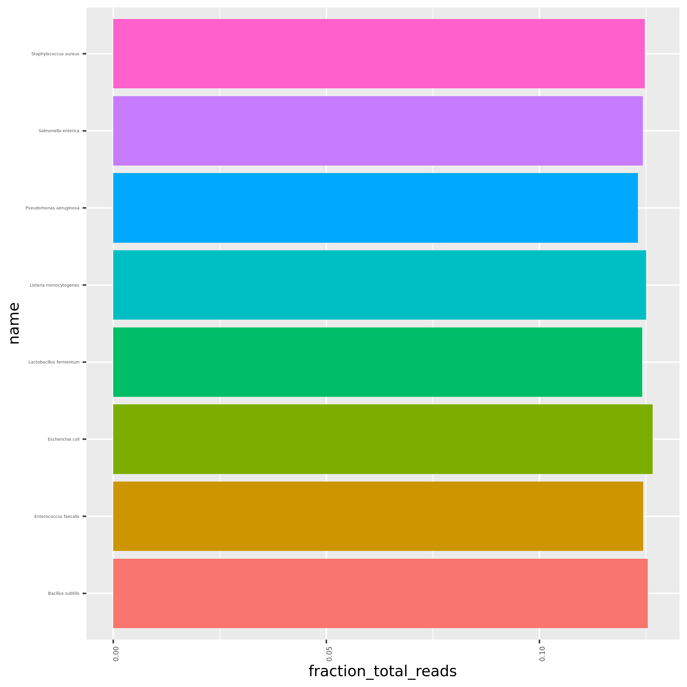

#  Benchmarking of de novo metagenomic assembly software

 :warning: WORK IN PROGRESS :warning:

## Table of Contents

* [Introduction](#introduction)
* [Methods](#methods)
    * [de novo Assembly tools](#de-novo-assembly-tools)
        * [bcalm2](#bcalm2)
        * [GATB-Minia Pipeline](#gatb-minia-pipeline)
        * [Minia](#minia)
        * [Unicycler](#unicycler)
        * [MEGAHIT](#megahit)
        * [MetaSPAdes](#metaspades)
        * [SPAdes](#spades)
        * [SKESA](#skesa)
        * [PANDAseq](#pandaseq)
        * [VelvetOptimier](#velvetoptimier)
        * [IDBA-UD](#idba-ud)
    * [Metagenomic datasets](#metagenomic-datasets)
        * [Zymobiomics Community Standard](#zymobiomics-community-standard)
        * [BMock12](#bmock12)
    * [Assessing Metagenomic Assembly Success](#assessing-metagenomic-assembly-success)
        * [Assembly Continuity](#assembly-continuity)
        * [Chimera Assessment](#chimera-assessment)
* [Results](#resuls)
    * [Zymobiomics Community Standard](#zymobiomics-community-standard)
        * [Mock Community](#mock-community)
        * [Even distributed](#even-distributed)
        * [Log distributed](#log-distributed)
* [Authors](#authors)

## Introduction

Shotgun metagenomics offers relatively unbiased pathogen detection and characterization in a single methodological step, 
with the drawbacks of increased data volume and complexity, requiring expert handling and appropriate infrastructure. 

The most common strategy for analysing metagenomic data is through *de novo* assembly followed by a combination of 
different tools for characterization. This approach creates longer sequences, which are more informative and can provide 
better insights into the structure of microbial communities. Several dedicated metagenomic assembly tools are available. 
These tools apply strategies that promise better handling of intragenomic and intergenomic repeats and uneven sequencing 
coverage when compared to traditional genome assemblers. However, there are no comprehensive benchmarks focusing on the 
performance of these tools. 

To assess the performance and limitations of currently available de novo assembly algorithms, we propose a benchmarking
of currently available and recently mantained *de novo* assembly tools, both traditional and dedicated for metagenomic 
data. 

We've compiled a list of 24 different *de novo* assembly tools, including 5 implementing Overlap, Layout and Consensus  
(OLC) assembly algorithm, 18 De Bruijn graph assemblers, of which 10 are single k-mer value assemblers and 8 implement
a multiple k-mer value approach, and a hybrid assembler using both OLC and single k-mer De Bruijn algorythms. Of these, 
12 were developed explicitly to handle metagenomic data. The complete list is available [as a google sheet](https://docs.google.com/spreadsheets/d/1d4x1IEivbe-Gk3PGmWRY5IgqpiC_mjji3846zDNYCtI/edit?usp=sharing).

## Methods

### *de novo* Assembly tools

To assess the performance and limitations of currently available *de novo* assembly algorithms, we benchmarked 11 
assemblers, including traditional and dedicated metagenomic assemblers, both using OLC, and De Bruijn with single and 
multiple k-mer values. The creteria was based on date of last update. 

The benchmarked assembly tools include 7 traditional - bcalm2, Minia, Unicycler, SPAdes, Skesa, PANDAseq and 
VelvetOptimizer - and 4 dedicated for metagenomic data - GATB-Minia Pipeline, MEGAHIT, MetaSPAdes, and IDBA-UD.

Docker containers for all assemblers were created, and the corresponding docker files can be found in the `docker/` 
repository.   

An assembly pipeline to perform concorrent assemblies with all tools in the benchmark was developed, in [Nextflow](https://www.nextflow.io/),
and it's available in the `nextflow/` directory of this repository. All resulting assemblies are filtered for a minimum 
contig length of 1000bp. 

The assembly performance is evaluated through mapping of the obtained assemblies to the reference sequences, with
[minimap2](https://github.com/lh3/minimap2). The assessment of the quality of the assembly is done after computation of
the percentage of mapped contigs, contiguity, average identity, and breadth of coverage. Assembly statistics, such as 
number of basepairs, number of contigs and N50 were also determined for each assembler. The scripts developed for this
are available in the `scripts/` directory, including the mapping commands. 
Performance metrics such as average run time, max memory usage, and average data read and written, are obtained through 
the Nextflow pipeline.

#### bcalm2
This assembler, publiched by [Chikhi et al, 2016](https://academic.oup.com/bioinformatics/article/32/12/i201/2289008) 
in *Bioinformatics*, is a fast and low memory algorithm for graph compaction, consisting of three stages: careful 
distribution of input k-mers into buckets, parallel compaction of the buckets, and a parallel reunification step to 
glue together the compacted strings into unitigs. It's a traditional single k-mer value De Bruijn assembler.
* Source code: [https://github.com/GATB/bcalm](https://github.com/GATB/bcalm)
* Date of last update: 06/10/2019
* Container: `cimendes/bcalm:2.2.1-1`

#### GATB-Minia Pipeline
GATB-Minia is an assembly pipeline, still unpublished, that consists Bloocoo for error correction,  Minia 3 for contigs 
assembly, which is based on the BCALM2 assembler, and the BESST for scaffolding. It was developed to extend Minia 
assembler to use multiple k-mer values. It was developed to extend the [Minia](#minia) assembler to use De Bruijn 
algorithm with multiple k-mer values. It's explicit for metagenomic data. 
* Source code: [https://github.com/GATB/gatb-minia-pipeline](https://github.com/GATB/gatb-minia-pipeline)
* Date of last update: 17/09/2019
* Container: `cimendes/gatb-minia-pipeline:17.09.2019-1`

#### Minia
This tool, published by [Chikhi & Rizk, 2013](https://almob.biomedcentral.com/articles/10.1186/1748-7188-8-22) in 
*Algorithms for Molecular Biology, performs the assembly on a data structure based on unitigs produced by the 
BCALM software and using graph simplifications that are heavily inspired by the [SPAdes](#spades) assembler.
* Source code: [https://github.com/GATB/gatb-minia-pipeline](https://github.com/GATB/gatb-minia-pipeline)
* Date of last update: 17/09/2019
* Container: `cimendes/gatb-minia-pipeline:17.09.2019-1`

#### Unicycler
An assembly pipeline for bacterial genomes that can do long-read assembly, hybrid assembly and short-read assembly. 
When asseblying Illumina-only read sets where it functions as a SPAdes-optimiser, using a De Bruijn 
algorithm with multiple k-mer values. It was published by [Wick et al. 2017](https://journals.plos.org/ploscompbiol/article?id=10.1371/journal.pcbi.1005595).
* Source code: [https://github.com/rrwick/Unicycler](https://github.com/rrwick/Unicycler)
* Date of last update: 16/08/2019
* Container: `cimendes/unicycler:0.4.8-1`

#### MEGAHIT
MEGAHIT, published by [Li et al. 2015](https://academic.oup.com/bioinformatics/article/31/10/1674/177884), *de novo* 
assembler for assembling large and complex metagenomics data in a time- and cost-efficient manner. It makes use of 
succinct de Bruijn graph, with a a multiple k-mer size strategy. In each iteration, MEGAHIT cleans potentially erroneous 
edges by removing tips, merging bubbles and removing low local coverage edges,specially useful for metagenomics which 
suffers from non-uniform sequencing depths. 
* Source code: [https://github.com/voutcn/megahit](https://github.com/voutcn/megahit)
* Date of last update: 12/08/2019
* Container: `cimendes/megahit-assembler:12.08.19-1`

#### MetaSPAdes
[SPAdes](#spades) started out as a tool aiming to resolve uneven coverage in single cell genome data, but later metaSPAdes was 
released, building specific metagenomic pipeline on top of [SPAdes](#spades). It was published by [Nurk et al. 2017](https://www.ncbi.nlm.nih.gov/pmc/articles/PMC5411777/), 
and like SPAdes, it uses multiple k-mer sizes of de Bruijn graph, starting with lowest kmer size and adding hypothetical 
kmers to connect graph. It's available at http://cab.spbu.ru/software/spades/ and https://github.com/ablab/spades
* Source code: [http://cab.spbu.ru/software/spades/](http://cab.spbu.ru/software/spades/)
* Date of last update: 12/10/2018
* Container: `cimendes/metaspades:11.10.2018-1`

#### SPAdes
A tool aiming to resolve uneven coverage in single cell genome data through multiple k-mer sizes of De Brujin graphs. It
starts with the smallest k-mer size and and adds hypotetical k-mers to connect graph. 
* Source code: [http://cab.spbu.ru/software/spades/](http://cab.spbu.ru/software/spades/)
* Date of last update: 12/10/2018
* Container: `cimendes/metaspades:11.10.2018-1`

#### SKESA
This *de novo* sequence read assembler is based on De Bruijn graphs and uses conservative heuristics and is designed to
create breaks at repeat regions in the genome, creating shorter assemblies but with greater sequence quality. It tries
to obtain good contiguity by using k-mers longer than mate length and up to insert size. It was recently published by
[Souvorov et al. 2018](https://genomebiology.biomedcentral.com/articles/10.1186/s13059-018-1540-z) and it's available at
https://github.com/ncbi/SKESA.
* Source code: [https://github.com/ncbi/SKESA/releases](https://github.com/ncbi/SKESA/releases)
* Date of last update: 09/10/2018
* Container: `flowcraft/skesa:2.3.0-1`

#### PANDAseq
This assembler, published by [Masella et al. 2012] in *BMC Bioinformatics*, implements an OLC algorithm to assemble 
genomic data. It align Illumina reads, optionally with PCR primers embedded in the sequence, and reconstruct an 
overlapping sequence. 
* Source code: [https://github.com/neufeld/pandaseq](https://github.com/neufeld/pandaseq)
* Date of last update: 30/08/2018
* Container: `cimendes/pandaseq:2.11-1`

#### VelvetOptimier
This optimizing pipeline, developed by Torsten Seeman, is still unpublished but extends the original [Velvet]() 
assembler by performing several assemblies with variable k-mer sizes. It searches a supplied hash value range for the 
optimum, estimates the expected coverage and then searches for the optimum coverage cutoff. It uses Velvet's internal 
mechanism for estimating insert lengths for paired end libraries. It can optimise the assemblies by either the default 
optimisation condition or by a user supplied one. It outputs the results to a subdirectory and records all its 
operations in a logfile.
* Source code: [https://github.com/tseemann/VelvetOptimiser](https://github.com/tseemann/VelvetOptimiser)
* Date of last update: 21/01/2017
* Container: `cimendes/velvetoptimiser:2.2.6-1`

#### IDBA-UD
Published by [Peng et al. 2012](https://academic.oup.com/bioinformatics/article-lookup/doi/10.1093/bioinformatics/bts174), 
it's a De Brujin graph assembler for assembling reads from single-cell sequencing or metagenomic sequencing technologies 
with uneven sequencing depths. It employs multiple depth relative thresholds to remove erroneous k-mers in both 
low-depth and high-depth regions. The technique of local assembly with paired-end information is used to solve the 
branch problem of low-depth short repeat regions. To speed up the process, an error correction step is conducted to 
correct reads of high-depth regions that can be aligned to high confidence contigs. 
* Source code: [https://github.com/loneknightpy/idba](https://github.com/loneknightpy/idba)
* Date of last update: 31/12/2016
* Container: `cimendes/idba:31.12.2016-3`

### Metagenomic datasets

#### Zymobiomics Community Standard

Two commercially available mock communities containing 10 microbial species (ZymoBIOMICS Microbial Community Standards) 
were sequences by [Nicholls et al. 2019](https://academic.oup.com/gigascience/article/8/5/giz043/5486468). Shotgun 
sequencing of the **Even and Log communities** was performed with the same protocol, with the exception that the Log 
community was sequenced individually on 2 flowcell lanes and the Even community was instead sequenced on an Illumina 
MiSeq using 2×151 bp (paired-end) sequencing. They are available under accession numbers: 
* [ERR2984773](https://www.ebi.ac.uk/ena/data/view/ERR2984773) (even) 
* [ERR2935805](https://www.ebi.ac.uk/ena/data/view/ERR2935805) (log)

With the [M3S3 tool](http://medweb.bgu.ac.il/m3s3/), a simulation sample was obtained made up of the Zymobiomics 
microbial community standasrd species of bacteria (n=8). The sample has the following composition (obtained with 
Kraken2 with the minimkaken2_V1 database):

  

##### BMock12
:warning:TODO:warning:

### Assessing Metagenomic Assembly Success
 
#### Assembly Continuity 
 
[Rick et al. 2019](https://github.com/rrwick/Long-read-assembler-comparison) proposed the use of a triple reference to 
assess chromosome contiguity while benchmaking long-read genomic assemblers. This measure is the longest single 
alignment between the assembly and the reference. 
Therefore, in terms of the reference length:

* Contiguity is 100% if the assembly went perfectly.
* Contiguity slightly less than 100% (e.g. 99.99%) indicates that the assembly was complete, but some bases were lost 
at the start/end of the circular chromosome.
* Contiguity more than 100% (e.g. 102%) indicates that the assembly contains duplicated sequence via a start-end overlap.
* Much lower contiguity (e.g. 70%) indicate that the assembly was not complete, either due to fragmentation or 
missassembly.

More information is available on [Rick's Assembly Benchmark GitHub page](https://github.com/rrwick/Long-read-assembler-comparison#assessing-chromosome-contiguity)

For each reference in the Zymos community standard, we've generated a chromosomal triple reference, available at 
`data/refereces/Zymos_Genomes_triple_chromosomes`. Each assembly was mapped against the triple chromosome references
with [minimap2](https://github.com/lh3/minimap2), published by [Li, 2018](https://academic.oup.com/bioinformatics/article/34/18/3094/4994778).
using the container `cimendes/minimap2:2.17-1`. 
Because each metagenomic sample is composed by more than one genome, the contings in the assemblies are mapped against 
all references and only the best result is kept with `--secondary=no` flag. The resulting mapping file, in 
[PAF format](https://github.com/lh3/miniasm/blob/master/PAF.md) describes the approximate mapping positions between each
mapped contig and the reference.

To obtain the mapping statistics, including contiguity, `assembly_stats.py` script is used available in the `scripts/`
directory. 

### Chimera Assessment
:warning:TODO:warning:

## Results

### Zymobiomics Community Standard
The results are available in the `results/` directory of this repository.
:warning:TODO:warning:
#### Mock Community
#### Even distributed
#### Log distributed

## Authors
* Inês Mendes 
    * Instituto de Microbiologia, Instituto de Medicina Molecular, Faculdade de Medicina, Universidade de Lisboa, 
    Lisboa, Portugal; 
    * University of Groningen, University Medical Center Groningen, Department of Medical Microbiology and Infection 
    Prevention, Groningen, The Netherlands
* Rafael Mamede
    * Instituto de Microbiologia, Instituto de Medicina Molecular, Faculdade de Medicina, Universidade de Lisboa, 
    Lisboa, Portugal; 
* Yair Motro 
    * Department of Health System Management, School of Public Health, Faculty of Health Sciences, Ben-Gurion 
University of the Negev, Beer-Sheva, Israel.